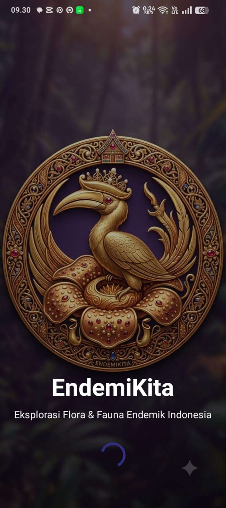
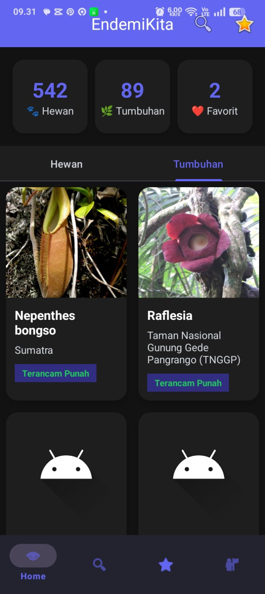
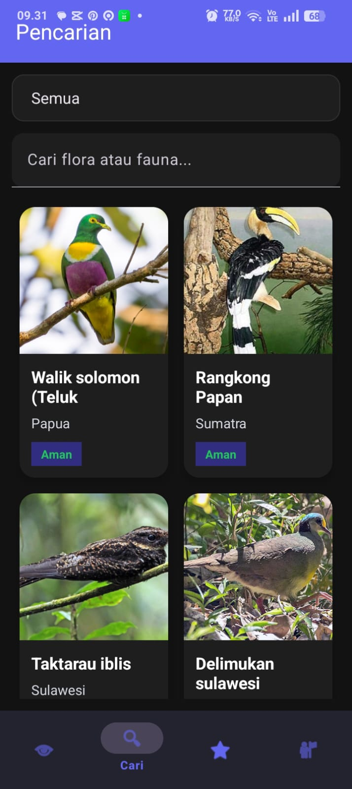
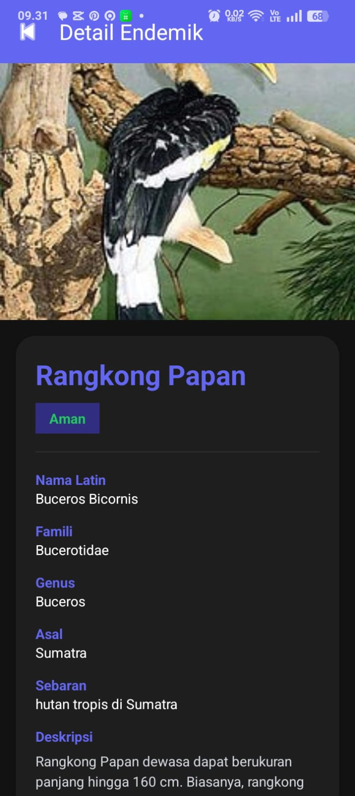
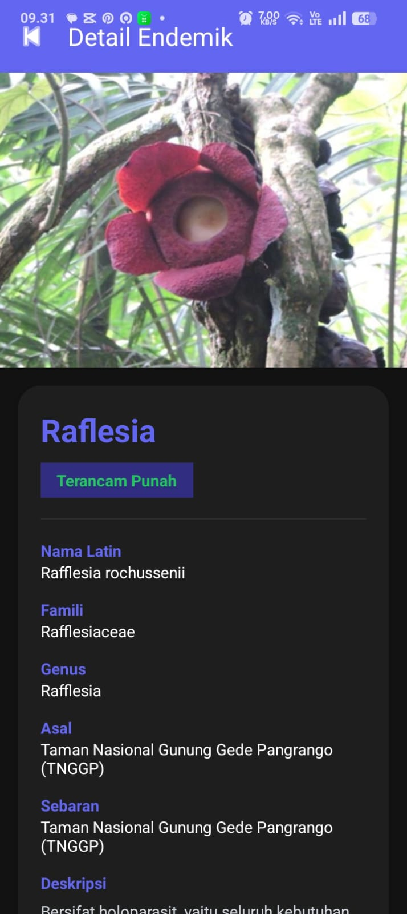
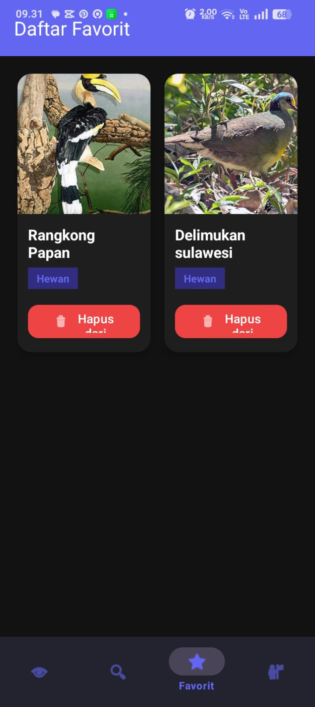
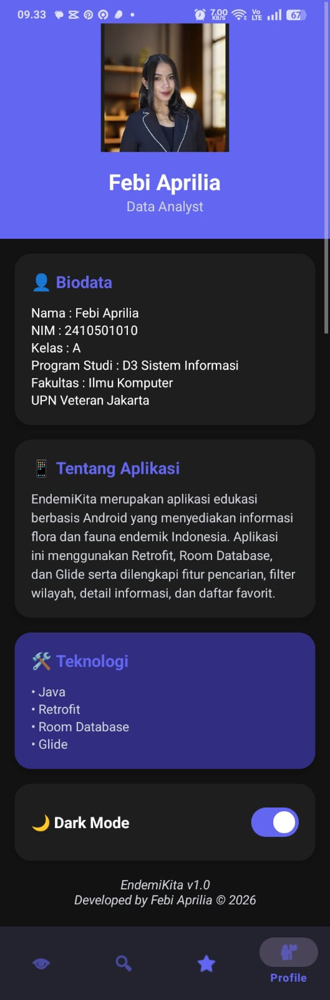

<p align="center">
  
</p>

<p align="center">
<b>Eksplorasi Flora & Fauna Endemik Indonesia</b>
</p>

---

**EndemiKita** merupakan aplikasi edukasi berbasis Android yang dikembangkan menggunakan **Java** pada **Android Studio**. Aplikasi ini bertujuan membantu masyarakat mengenal flora dan fauna endemik Indonesia melalui penyajian informasi yang interaktif, mudah diakses, dan menarik.

Data spesies diperoleh melalui **REST API** berbasis JSON, sedangkan fitur favorit menggunakan **Room Database** sehingga data tetap tersimpan secara lokal pada perangkat.

---

# 👩‍💻 Informasi Mahasiswa

| Keterangan     | Informasi                             |
| -------------- | ------------------------------------- |
| Nama           | **Febi Aprilia**                      |
| NIM            | **2410501010**                        |
| Program Studi  | D3 Sistem Informasi                   |
| Fakultas       | Fakultas Ilmu Komputer                |
| Universitas    | UPN Veteran Jakarta                   |
| Mata Kuliah    | Pemrograman Mobile                    |
| Dosen Pengampu | Ruth Mariana Bunga Wadu, S.Kom., MMSI |

---

# ✨ Fitur Aplikasi

* Splash Screen
* Dashboard Statistik Endemik
* Daftar Hewan Endemik
* Daftar Tumbuhan Endemik
* Search Flora & Fauna
* Detail Informasi Spesies
* Favorit (Room Database)
* Profile Developer
* Dark Mode

---

# 🛠 Teknologi

* Java
* Android Studio
* Retrofit
* Gson
* Room Database
* RecyclerView
* Glide
* Material Design
* REST API

---

# 📥 Cara Menjalankan Project

### Clone Repository

```bash
git clone https://github.com/fbyprl29/EndemiKita.git
```

### Masuk ke Folder

```bash
cd EndemiKita
```

### Buka Android Studio

Pilih **Open Existing Project**, kemudian pilih folder **EndemiKita**.

### Sync Gradle

Tunggu hingga seluruh dependency selesai diunduh.

### Jalankan

Klik tombol **Run ▶** pada Android Studio.

---

[](https://drive.google.com/drive/folders/1qpmFypDrNdlPCCqZgltyz2cF-wvrJrR2?usp=sharing)

# Screenshot Aplikasi

## Splash Screen


---

## Home Screen



---

## Search Screen



---

## Detail Screen



---

## Detail Screen



---

## Favorit Screen



---

## Profile Screen



---

# 📂 Struktur Project

```
EndemiKita
│
├── app
├── gradle
├── screenshots
├── docs
├── README.md
└── build.gradle.kts
```

---

# 🌐 REST API

Dataset yang digunakan:

https://hendroprwk08.github.io/data_endemik/endemik.json

---

# 📚 Referensi

* Android Developers
* Retrofit Documentation
* Room Database Documentation
* Glide Documentation

---

# 📄 Lisensi

Project ini dibuat sebagai tugas akhir Mata Kuliah **Pemrograman Mobile** Program Studi D3 Sistem Informasi Fakultas Ilmu Komputer Universitas Pembangunan Nasional Veteran Jakarta.

---

⭐ Terima kasih telah mengunjungi repository **EndemiKita**.
